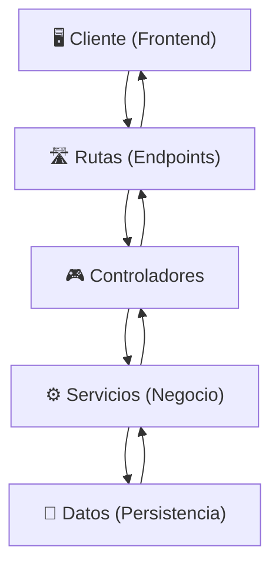

# 🏗️ Arquitectura por Capas – Proyecto Fruna

El proyecto **Fruna** está diseñado bajo una **arquitectura por capas**, lo que facilita la separación de responsabilidades, el mantenimiento y la futura migración de persistencia en archivos JSON a una base de datos.

## Diagrama de capas

---

## 1) Rutas (Routes)
- **Rol:** Definen los **endpoints de la API** que atenderá el sistema.  
- **Función:** Reciben la petición HTTP desde el cliente y la envían al controlador correspondiente.  
- **Ejemplos:**  
  - `/api/usuarios` → gestión de clientes.  
  - `/api/productos` → consulta y gestión de productos.  
  - `/api/pedidos` → gestión de compras y carrito.  
---

## 2) Controladores (Controllers)
- **Rol:** Actúan como intermediarios entre las rutas y los servicios.  
- **Función:**  
  - Validan los datos de las solicitudes (ej: campos obligatorios, tipos de datos).  
  - Invocan los métodos de la capa de servicios.  
  - Devuelven la respuesta HTTP (datos, errores, confirmaciones).  
- **Ejemplos:**  
  - Validar que un usuario ingrese email y contraseña al inciar sesión.  
  - Validar que un producto tenga nombre y precio antes de crearse.  
---

## 3) Servicios (Services)
- **Rol:** Implementan la **lógica de negocio** del sistema.  
- **Función:**  
  - Contienen las reglas principales (ej: cálculos de precios, validaciones avanzadas, simulación de boleta/factura).  
  - Se comunican con la capa de datos para obtener o guardar información.  
- **Ejemplos:**  
  - Calcular el total de un carrito de compras.  
  - Procesar un pedido y cambiar el stock de los productos.  
  - Registrar el historial de compras de un cliente.  
---

## 4) Capa de Datos (Persistencia)
- **Rol:** Gestiona el **almacenamiento de la información**.  
- **Función:**  
  - Leer y escribir datos en archivos **JSON** (persistencia inicial).  
  - Permitir migrar fácilmente a **SQLite** en etapas posteriores.  
- **Ejemplos:**  
  - `usuarios.json` → almacena clientes registrados.  
  - `productos.json` → almacena catálogo de productos.  
  - `pedidos.json` → almacena compras realizadas.  
---
